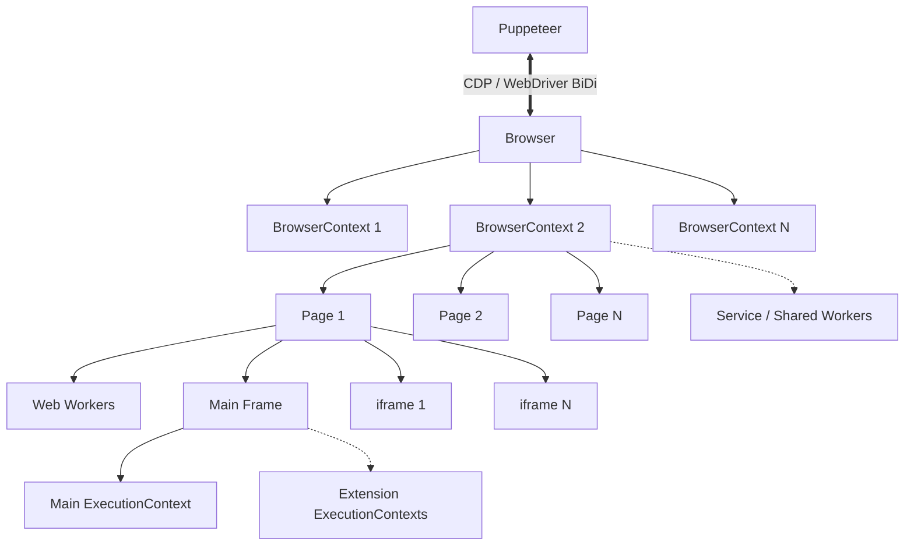

# Visión General de la Arquitectura de Puppeteer

Este documento describe la jerarquía estructural de objetos, los contextos de ejecución y los protocolos de comunicación dentro de Puppeteer.

## Diagrama de la Jerarquía de Objetos

## Desglose de la Jerarquía

- **Puppeteer**: Punto de entrada principal. Se comunica con la instancia del navegador mediante Chrome DevTools Protocol (CDP) o WebDriver BiDi.
- **Browser**: Representa el proceso del navegador en ejecución (Chrome, Chromium o Firefox).
- **BrowserContext**: Sesiones de navegador aisladas (similares a las ventanas de incógnito) con cookies, caché y almacenamiento independientes.
- **Page**: Pestañas o páginas individuales del navegador que se ejecutan dentro de un `BrowserContext`.
- **Frame**: Objetivos estructurales dentro de una `Page`, que representan el documento principal o los `iframes` incrustados.
- **ExecutionContext**: Entornos aislados de ejecución de JavaScript donde se ejecutan los scripts (frames, web workers o scripts de extensiones del navegador).
