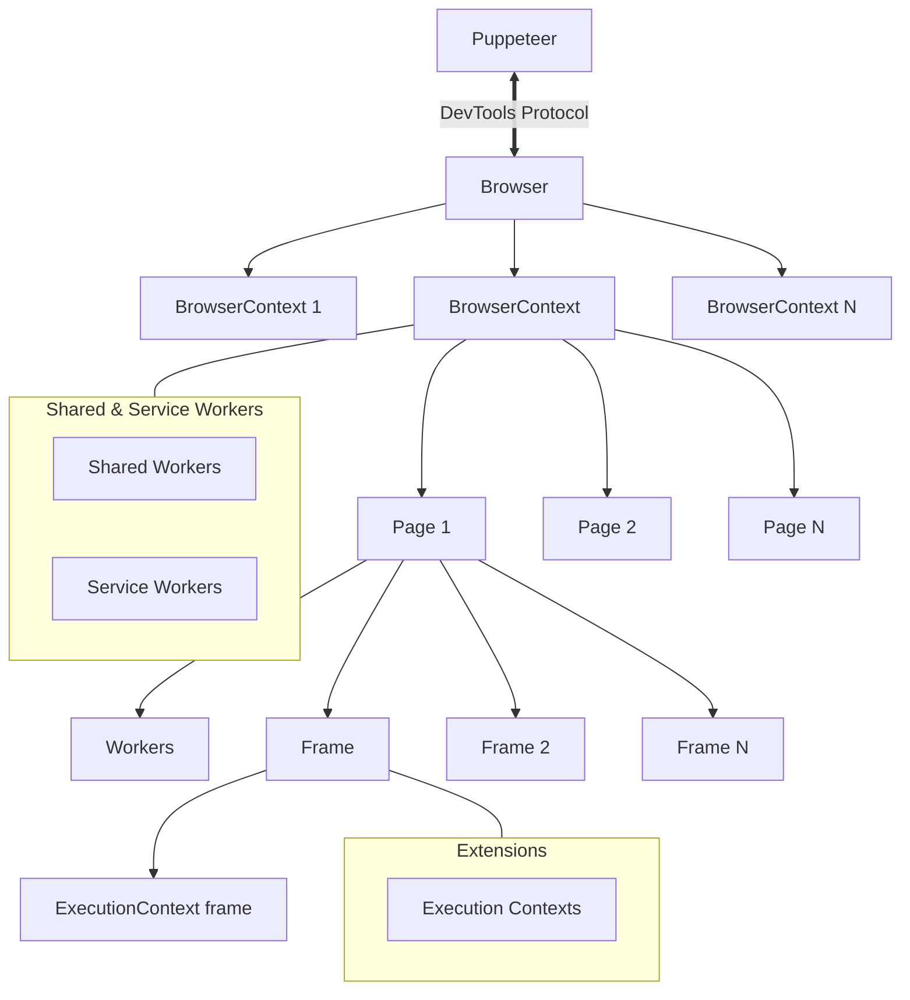

# Puppeteer Architecture Overview

This diagram represents the structural hierarchy of objects and execution contexts within Puppeteer:

## Hierarchy Breakdown

- **Puppeteer**: Primary entry point using DevTools Protocol / BiDi to communicate with the browser instance.
- **Browser**: Represents the running browser process.
- **BrowserContext**: Isolated sessions (like Incognito windows) with independent cookies and cache.
- **Page**: Individual tabs or pages running inside a `BrowserContext`.
- **Frame**: Execution targets within a `Page` (main frame and `iframes`).
- **ExecutionContext**: JavaScript execution environments attached to frames or web workers.
