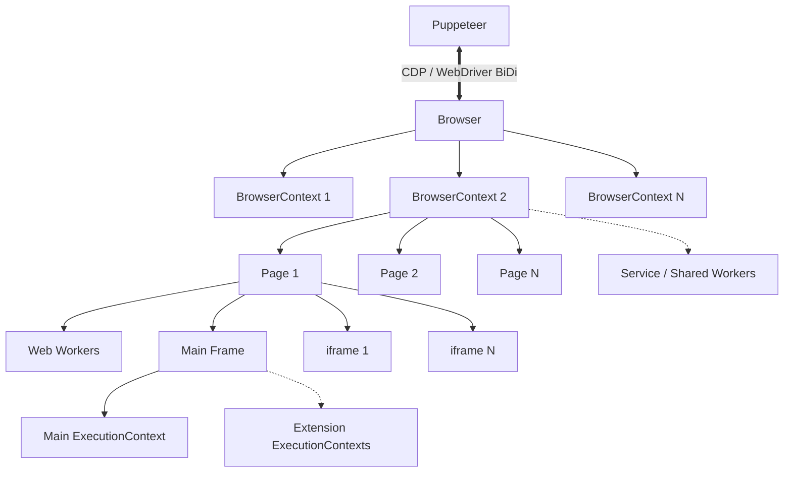

# Puppeteer Architecture Overview

This document describes the structural hierarchy of objects, execution contexts, and communication protocols within Puppeteer.

## Object Hierarchy Diagram

## Hierarchy Breakdown

- **Puppeteer**: Primary entry point. Communicates with the browser instance over Chrome DevTools Protocol (CDP) or WebDriver BiDi.
- **Browser**: Represents the running browser process (Chrome, Chromium, or Firefox).
- **BrowserContext**: Isolated browser sessions (similar to Incognito windows) with independent cookies, cache, and storage.
- **Page**: Individual browser tabs or pages running within a `BrowserContext`.
- **Frame**: Structural targets within a `Page`, representing the main document or embedded `iframes`.
- **ExecutionContext**: Isolated JavaScript execution environments where scripts run (frames, web workers, or browser extension scripts).
